# Lab2Web
Latihan_2 16-3-2022

## Belajar CSS Internal dan Inline CSS

### Membuat Contoh website html
Langkah pertama membuat contoh web html terlebih dahulu
kodinganya seperti ini

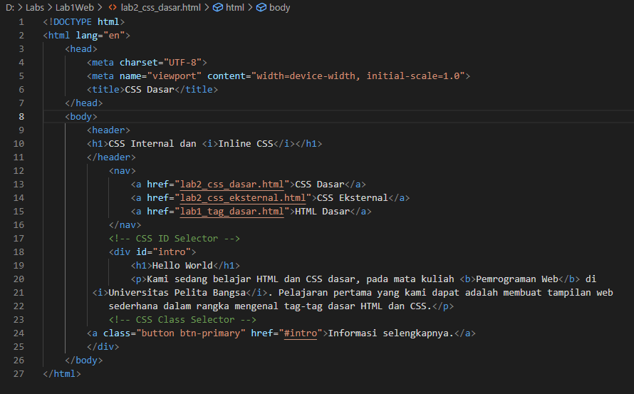

Tampilan website nya seperti ini

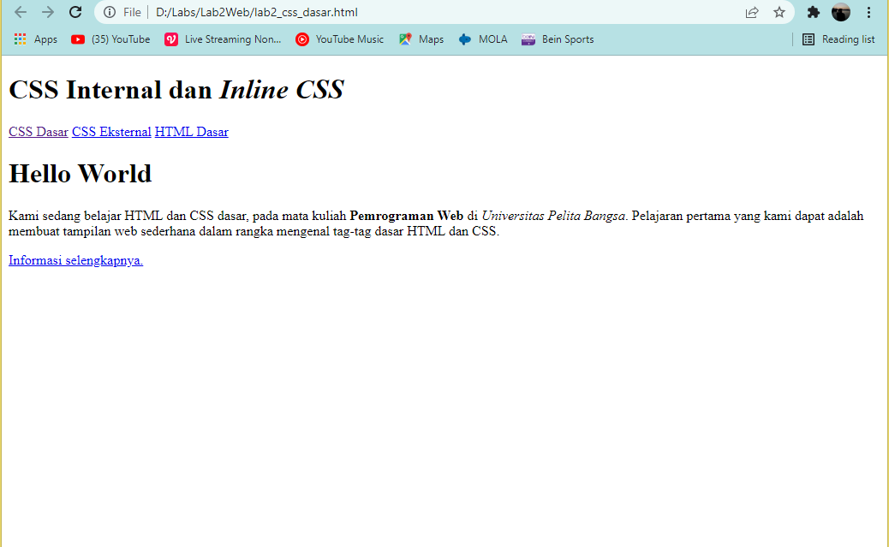

### Menambahkan deklarasi CSS Internal
Langkah selanjutnya menambahkan deklarasi css internal, tambahkan pada bagian head
kodinganya seperti ini

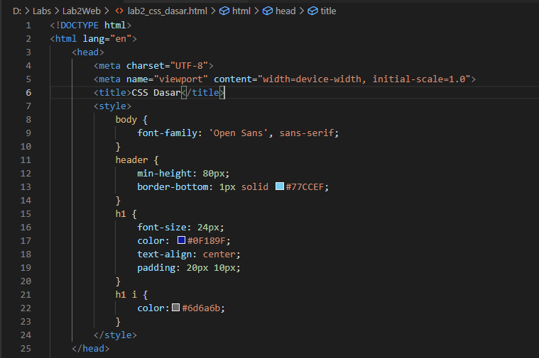

Tampilan website nya akan seperti ini

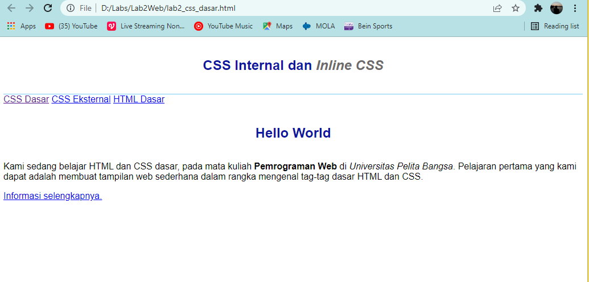

### Menambahkan inline CSS
Kemudian tambahkan deklarasi inline CSS pada tag `
`
Kodinganya seperti ini

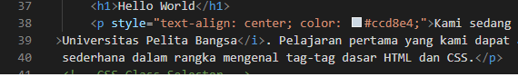

Tampilan website nya akan seperti ini

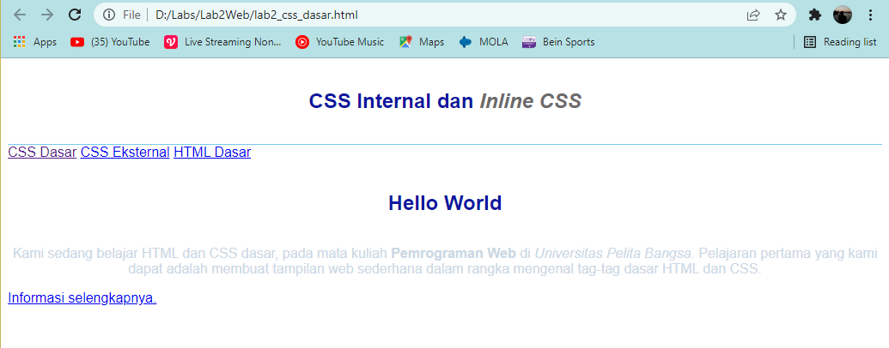

### Menambahkan CSS Eksternal
Langkah awal buat deklarasi terlebih dahulu, contoh kodinganya seperti ini

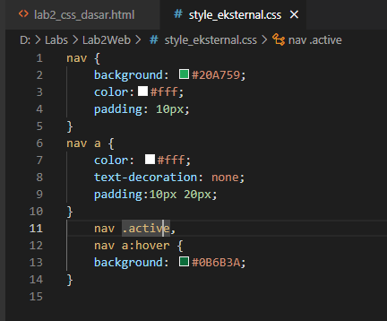

Kemudian save file css eksternal berikut di dalam folder yang sama

Kemudian tambahkan tag `<link>` untuk merujuk file css yang sudah dibuat pada bagian `<head>`

Kodinganya seperti ini

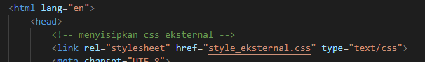

Tampilan website nya akan seperti ini

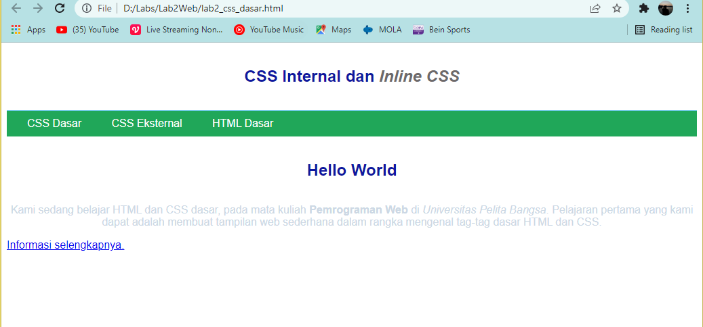

### Menambahkan CSS Selector
Selanjutnya menambahkan CSS Selector menggunakan ID dan Class Selector.
kodingannya seperti ini

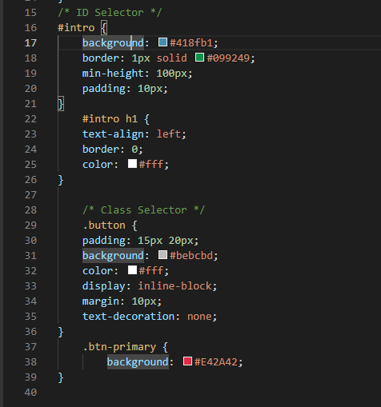

Tampilan website nya akan seperti ini

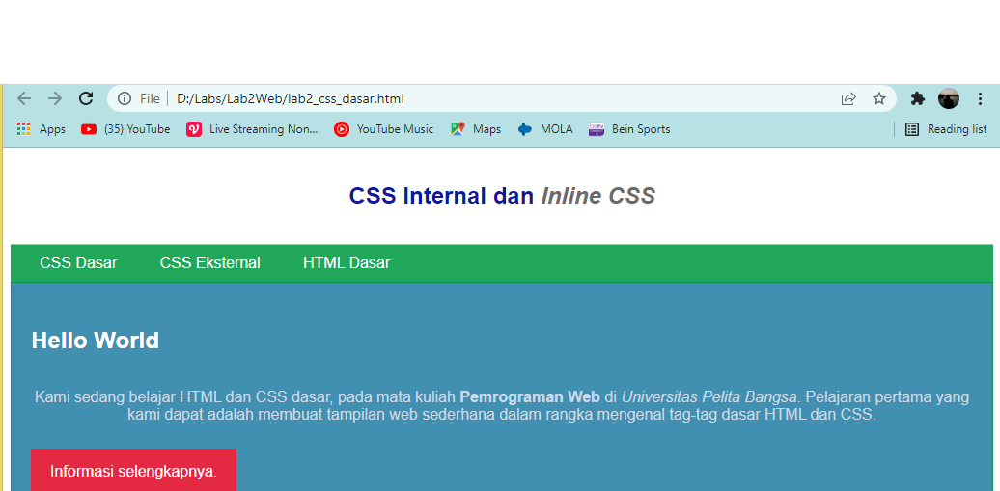
